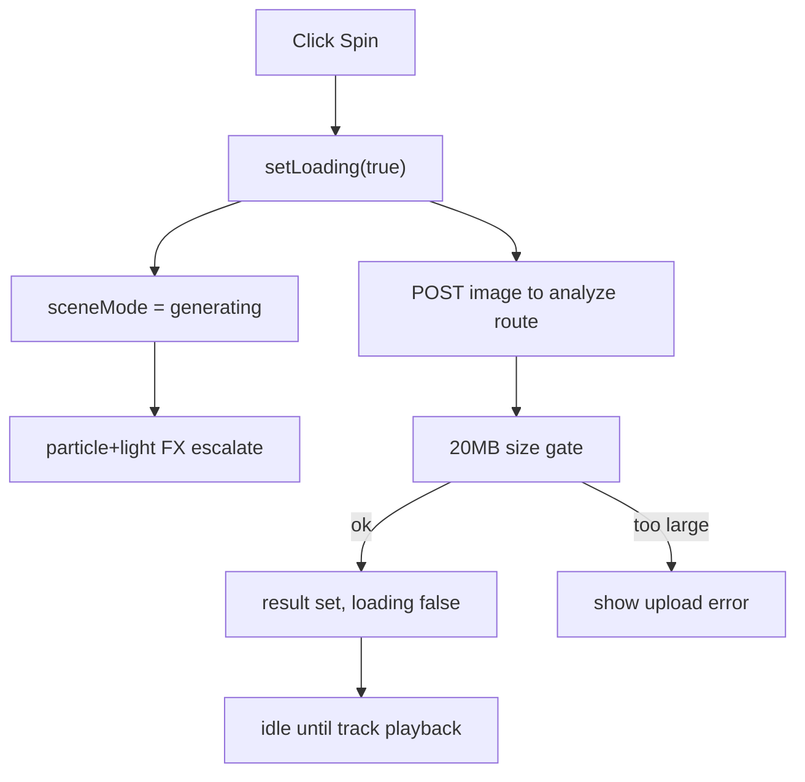

# 20MB Upload + Full-Bleed + Spin FX

## Scope and targets

- Shared upload/API limit: [c:\Users\buyss\Manifold Delta\Artifactsvault\00_shards\app\api\experiments\image-to-spotify\analyze\route.ts](c:\Users\buyss\Manifold Delta\Artifactsvault\00_shards\app\api\experiments\image-to-spotify\analyze\route.ts)
- V2 upload flow and local validation: [c:\Users\buyss\Manifold Delta\Artifactsvault\00_shards\experiments\image-to-spotify\ui\v2\JukeboxPageV2.tsx](c:\Users\buyss\Manifold Delta\Artifactsvault\00_shards\experiments\image-to-spotify\ui\v2\JukeboxPageV2.tsx)
- V2 upload UI structure: [c:\Users\buyss\Manifold Delta\Artifactsvault\00_shards\experiments\image-to-spotify\ui\v2\JukeboxUploadDock.tsx](c:\Users\buyss\Manifold Delta\Artifactsvault\00_shards\experiments\image-to-spotify\ui\v2\JukeboxUploadDock.tsx)
- V2 full-bleed styling: [c:\Users\buyss\Manifold Delta\Artifactsvault\00_shards\experiments\image-to-spotify\ui\v2\JukeboxPageV2.module.css](c:\Users\buyss\Manifold Delta\Artifactsvault\00_shards\experiments\image-to-spotify\ui\v2\JukeboxPageV2.module.css)
- V2 scene animation logic: [c:\Users\buyss\Manifold Delta\Artifactsvault\00_shards\experiments\image-to-spotify\ui\v2\JukeboxScene.tsx](c:\Users\buyss\Manifold Delta\Artifactsvault\00_shards\experiments\image-to-spotify\ui\v2\JukeboxScene.tsx)

## Implementation plan

1. **Increase upload cap to 20 MB (no Supabase dependency)**

- Replace the current `4 * 1024 * 1024` limit with `20 * 1024 * 1024` in the shared analyze route.
- Update the API error copy so users see the new cap consistently.
- Keep the current direct-upload flow (`FormData` to route handler) so no storage backend migration is required.

1. **Add matching client-side guard for faster feedback**

- In `JukeboxPageV2`, add a `MAX_UPLOAD_BYTES` constant (20 MB) and reject oversized files in `handleFileChange` before submit.
- Surface a clear inline error in the existing upload error slot.
- Keep MIME checks as-is (JPG/PNG/WEBP/GIF).

1. **Make the upload photo full-bleed in the jukebox bay**

- Tighten overlay inset for the upload aperture in `handleOverlayRects` so the DOM panel maps flush to the 3D bezel.
- Update upload CSS so the selected image truly fills its frame edge-to-edge (`display: block`, no inner rounding/padding artifacts, preserve `object-fit: cover`).
- If needed, move controls to a compact bottom strip so the image area reads as the dominant full-bleed surface.

1. **Amplify Spin-time Three.js effects (on click -> generating mode)**

- Extend the existing `m === "generating"` branch in `JukeboxScene.animate()`:
  - Increase particle energy (count/speed/opacity/size jitter) while generating.
  - Add a second accent particle layer for brighter streak/spark behavior.
  - Pulse additional lights (front/rim/bar/spot) instead of only key/fill.
  - Drive side/marquee glow intensity with a rhythmic phase so “Spin” feels active.
- Preserve calmer behavior for `idle` and audio-reactive behavior for `playing`.

1. **Verification pass**

- Validate with a file just under 20 MB (accepted) and one over 20 MB (clean rejection).
- Confirm uploaded image visually fills the upload bay without letterboxing.
- Confirm clicking `Spin` immediately transitions to stronger generation effects and then settles when loading ends.
- Run lint checks on edited files and fix any introduced issues.

## Flow snapshot

